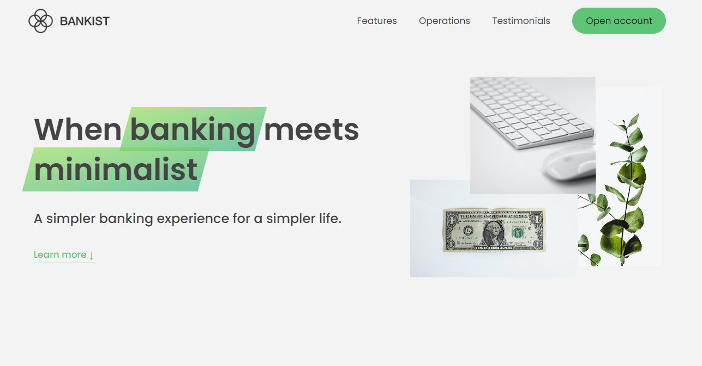

# Bankist Website

This is a simple digital banking website that I built while taking a [Udemy Course](https://www.udemy.com/course/the-complete-javascript-course/). The website showcases the use of smooth scrolling, sticky navigation, slider testimonial, and tab components.

<h1 align="center">
    
</h1>

##⭐Features
- Smooth scrolling
- Sticky navigation bar
- Slider testimonial section with transition effects 
- Tabbed component for banking operations

##💎Technologies Used
The following technologies were used to build this project:

##💡Getting Started

To view this project, simply access [this link](https://hariyebk.github.io/Bankist-website/). Alternatively, you can download or clone the repository from
[GitHub](https://github.com/hariyebk/Bankist-website).

Once downloaded/cloned or in browser open the `index.html` file to view the website.

### Prerequisites

You do not need any additional software or dependencies installed to run this code. You will need an internet connection and a web browser installed.

### Installation 

1. Clone/download repository from GitHub.
2. Open `index.html` using your preferred web browser.
3. That's it! enjoy browsing through the digital banking site!

##✨Contributing 

Contributions are welcome and encouraged! To contribute please follow these steps:

1. Fork this repository by clicking on "Fork" button at right top corner of page.
2. Create new branch: `git checkout -b my-new-feature`
3. Make changes to files according to desired feature(s).
4. Commit your changes: `git commit -am 'Add some feature'`.
5. Push to the branch: `git push origin my-new-feature`
6 Submit a pull request by opening PR in original respository (not yours)

I review all pull requests thoroughly and appreciate every contribution made.

If you find any bugs/issues/errors please create an issue ticket/appropriate category within issues in Github.

## About

this project was developed in The Complete JavaScript Course 2023: From Zero to Expert! couse.
https://www.udemy.com/course/the-complete-javascript-course/

Created by ** Jonas Schmedtmann **  
Developed by ** Harun Bekri **

## License 

This project is licensed under MIT license - see LICENSE.md for more details.
